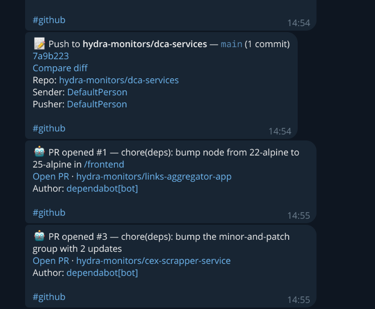

# GitHub Notifier Bot

<p align="center">
  
  <br><br>
  
  
  
</p>

Telegram bot that forwards GitHub webhook events to Telegram channels.

## Setup

```bash
uv sync
cp .env.example .env  # fill in BOT_TOKEN, GITHUB_WEBHOOK_SECRET
uv run python -m bot
```

## Webhook

Payload URL: `https://<your-domain>/webhook/github`, content type `application/json`, secret = `GITHUB_WEBHOOK_SECRET`.

## Config

Single channel via env vars (see `.env.example`) or multi-channel via `config.yaml` (see `config.yaml.example`).
